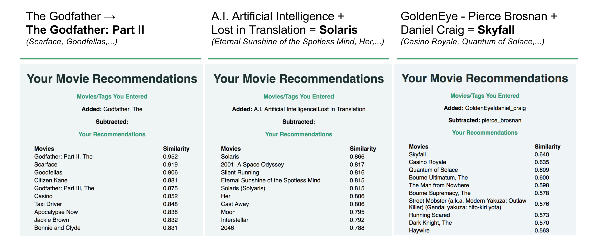

# Movie2Vec

Movie recommender that enables the user to conduct arithmetic operations between movies (and movie-tags) to uncover interesting relationships between movies. Utilizes Word2Vec algorithm to create tag vectors, from which higher-level movie vector representations are created. Built Flask web app through which users can add/subtract movies and get recommendations.

### Motivation

My initial motivation for this project was that I wanted to create a different type of recommender that "learns" unique relationships between the items it's recommending. I'm a movie buff, and I wanted to see if there was a mathematical relationship between movies - say, if you added one movie to another, could you get a third movie that made sense? I'm also interested by NLP and neural networks, and was fascinated by the algorithm Word2Vec (which is kind of a mix of both) and figured this would be a good project to learn more about it.

### Context

Some background on Word2Vec: Word2Vec is essentially a shallow neural network that (under one particular architecture) predicts a word given its context words in a sentence. The neat thing about this model is that after it is trained, out of it comes vector representations of the words. You can then add and subtract these words from each other and uncover analogous relationships. I wanted to use this same approach to movies.

### Data & Processing

I used the publicly available MovieLens Latest dataset, which had about 45,000 movies and 48,000 unique tags for the movies. After a little bit of feature engineering, I had an updated dataframe where each row was a movie and it's corresponding tags. For example, one row looks like:

> The Godfather | Crime, must-see, Al Pacino, mafia, oranges, ...

Then I trained my Word2Vec model on these "sentences" of tags and got vector representations of the tags (so for example I got a vector for "Crime", a vector for "Al Pacino", a vector for "oranges", etc.). Ultimately though, I wanted higher-level vector representations for the movies themselves, since I wanted to add and subtract them from each other. After attempting a couple different approaches I decided to average the vectors for all of the tags for each movie to get movie vectors.

Finally, I created a Flask web app where users can input movies/tags to add and subtract. Calculating the cosine similarity of the resulting vector to all the movie vectors, I was able to return a list of the top 10 closest movies to that result. These ultimately were my model's recommendations.

### Results

Below are some recommendations for example inputs (the web app interface is still being improved):

One simple use case of the recommender is to give it one movie (like The Godfather), and it will recommend a list of similar movies. You can add 2 movies of different genres (like sci-fi and romance), and the recommendations are mostly movies that are a hybrid of both genres. More interestingly though, since the tag vectors and movie vectors exist in the same vector space, you can add and subtract them from each other. If you take the Bond film GoldenEye (starring Pierce Brosnan as 007), subtract Pierce Brosnan, and add Daniel Craig, the top recommendations are Daniel Craig's Bond movies.

### Next Steps

I am currently working on making my web app live for people to use without running locally on their machine. I will continue developing it to make it more user friendly (and enable it to better parse user input).

Additionally, I'd like to extend the application to better add/subtract directors, actors/actresses, and screenwriters - possibly by scraping additional data from IMDB and joining it with the data I have, to make these features more standardized.

And finally, I want to do some t-SNE or k-means clustering of my movie vectors for visualization purposes, to get a better sense of how my model is grouping them.
